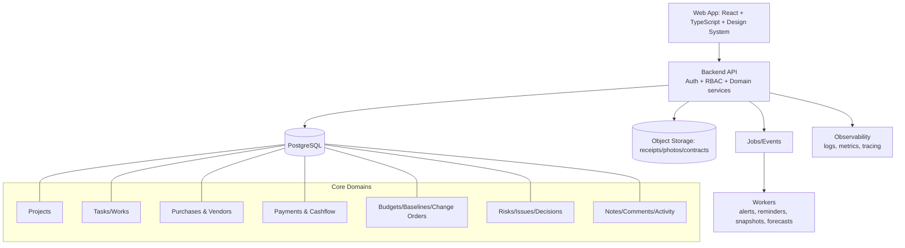

# Beausoleil App — Current-State Schema + 10x Revamp Blueprint

## 1) What the app is today (in plain terms)

Beausoleil is a **single-page renovation command center** used to track:
- **Works** (construction tasks)
- **Purchases** (furniture/fixtures and delivery progress)
- **Payments** (cash-out status)
- **Cost drivers** (forecast vs actual mapping)
- **Weekly notes** (copyable project update)

It is optimized for one project and one team, with direct inline editing and auto-save.

---

## 2) Current architecture schema (as-is)

```mermaid
flowchart TD
    U[User in Browser] --> UI[Single HTML file\nReact + Babel via CDN]
    UI --> ST[In-memory React state\nworks, purchases, payments, notes, weekDate]
    ST --> CALC[Derived metrics\nbudget, progress, variance, urgency, timeline]
    ST --> RENDER[Tabs + Tables + Cards + Gantt + Notes]
    ST --> SAVE[Debounced autosave ~900ms]
    SAVE --> API[jsonbin.io REST API]
    API --> LOAD[Initial load / migration logic]
    LOAD --> ST

    subgraph Data Model
      W[works[]\nid,name,owner,status,eta,done]
      P[purchases[]\nid,name,room,owner,status,eta,price,url,done]
      PAY[payments[]\nid,name,amount,owner,status,eta,done]
      N[notes, weekDate]
    end

    ST --- W
    ST --- P
    ST --- PAY
    ST --- N
```

### Runtime characteristics
- **Deployment model:** static HTML file; no build step.
- **Framework model:** React UMD + Babel in browser (runtime transpilation).
- **Persistence model:** direct client-side calls to JSONBin.
- **Security model:** API key embedded client-side.
- **State model:** one top-level App state tree, manually passed to tab components.
- **Domain model:** tightly coupled to one renovation workflow and one locale.

---

## 3) Category-by-category assessment of current state

## A. Product / UX
**Strengths**
- Fast to use, no login friction.
- Rich visual management (overview, gantt, urgent list, cost drivers).
- Mobile layout exists (card mode for tables).

**Gaps**
- Single project only.
- No role-based workflows (owner/contractor/accountant views).
- No audit trail, approvals, or discussion threads.

## B. Frontend architecture
**Strengths**
- Componentized enough for a single file.
- Good inline editing ergonomics.

**Gaps**
- Monolithic file couples style, data, business rules, and rendering.
- No type safety.
- Derived business logic scattered inside render functions.

## C. Backend / data
**Strengths**
- Simple persistence via JSONBin.
- Resilient fallback defaults and basic migration path.

**Gaps**
- No real backend domain or APIs.
- No relational integrity, no historical records.
- No concurrency controls (last write wins).

## D. Security / compliance
**Strengths**
- Uses HTTPS APIs.

**Critical gaps**
- Publicly embedded master API key.
- No user auth, no permissions, no secrets management.

## E. Operations / reliability
**Strengths**
- Works as a static artifact.

**Gaps**
- No monitoring, no error telemetry, no backup strategy.
- No CI/CD quality gates.

## F. Analytics / decision support
**Strengths**
- Helpful cost-driver computations and urgency surfacing.

**Gaps**
- Rule logic is hardcoded and non-configurable.
- No forecasting engine, scenario planning, or baseline snapshots.

---

## 4) 10x target schema (to-be)



### 10x outcomes
- Multi-project, multi-user, secure-by-default platform.
- Configurable workflows + auditability.
- Reliable financial truth (actual vs committed vs forecast).
- Automated alerts and decision intelligence.

---

## 5) 10x revamp plan — step by step, category by category

## Phase 0 — Vision, constraints, and success metrics (1–2 weeks)
### Product
1. Define top 5 outcomes (e.g., budget variance reduction, fewer late tasks).
2. Lock MVP personas: Owner, PM, Finance, Contractor.
3. Define north-star metrics and SLAs.

### Technical
4. Choose stack: React + TS, Node/Nest or Next API, PostgreSQL, object storage.
5. Define security baseline (auth provider, RBAC matrix, secrets strategy).
6. Define migration strategy from JSONBin data.

---

## Phase 1 — Foundation (2–4 weeks)
### Architecture
1. Split monolith into repo structure:
   - `apps/web`
   - `apps/api`
   - `packages/ui`
   - `packages/domain`
2. Establish typed contracts (OpenAPI or tRPC schemas).
3. Add environment profiles and secret vault integration.

### Data
4. Create relational schema:
   - projects, users, memberships
   - tasks, task_updates
   - purchases, vendors
   - payments, invoices
   - budgets, budget_lines, change_orders
   - notes, comments, attachments
   - activity_log
5. Write idempotent migration scripts from existing JSON shape.

### Platform
6. Add CI pipeline: lint, typecheck, test, build, security scan.
7. Add observability: error tracking + structured logs.

---

## Phase 2 — Secure core product parity (4–8 weeks)
### Security first
1. Implement login (OIDC/Auth0/Clerk/etc.).
2. Enforce RBAC at API + UI levels.
3. Remove client-exposed persistence keys.

### Core modules
4. Rebuild tabs as domain modules:
   - Overview
   - Works
   - Purchases
   - Payments
   - Cost Drivers
   - Notes
5. Preserve existing calculations, but move to tested domain services.
6. Add optimistic UI + conflict-aware updates.

### Reliability
7. Add automatic snapshots/versioning for every save.
8. Add rollback to previous snapshot.

---

## Phase 3 — Financial intelligence and controls (4–6 weeks)
### Budgeting
1. Introduce **baseline budget versions** and change-order flow.
2. Track committed/paid/forecast at line-item granularity.
3. Add tolerance bands per category.

### Payments
4. Add payment lifecycle:
   - Draft → Approved → Scheduled → Paid
5. Attach receipts/invoices to each payment.
6. Generate monthly cash-flow forecasts.

### Cost drivers
7. Replace hardcoded mapping with configurable mapping rules.
8. Add variance root-cause tagging (scope, price, delay, rework).

---

## Phase 4 — Workflow and collaboration (3–5 weeks)
### Project operations
1. Add issue/risk register with owner + due date + mitigation.
2. Add decision log linked to cost/schedule impact.
3. Add threaded comments and @mentions on entities.

### Automations
4. Alerting engine (overdue, blocked > X days, over-budget > Y%).
5. Weekly digest generation (email/Slack/WhatsApp export).
6. Calendar sync for deadlines and site visits.

---

## Phase 5 — 10x UX and ecosystem (4–8 weeks)
### UX upgrade
1. Build a design system with reusable table/card/edit controls.
2. Add command palette and global quick-add.
3. Add timeline zoom and dependency lines in Gantt.

### Integrations
4. Vendor catalog integrations (IKEA/Amazon/manual import adapters).
5. Accounting export (CSV + QuickBooks/Xero compatible mapping).
6. BI connector (Looker/Metabase-ready data marts).

### Intelligence
7. Forecast completion date confidence bands.
8. Predict likely overruns from leading indicators.
9. Recommendation layer: top 3 actions to stay on plan.

---

## 6) Suggested new domain schema (minimal)

- `projects(id, name, start_date, target_date, currency, status)`
- `users(id, email, name)`
- `project_members(project_id, user_id, role)`
- `tasks(id, project_id, title, owner_id, status, eta, completed_at, room, type)`
- `purchases(id, project_id, title, vendor_id, room, status, eta, price_estimate, price_actual, url)`
- `payments(id, project_id, title, vendor_id, amount, status, due_date, paid_date, reference)`
- `budget_versions(id, project_id, version_no, created_at, is_baseline)`
- `budget_lines(id, budget_version_id, category, subcategory, amount)`
- `cost_mappings(id, project_id, rule_name, source_type, source_match, category)`
- `notes(id, project_id, body, week_of, author_id)`
- `activity_log(id, project_id, entity_type, entity_id, action, actor_id, payload, created_at)`

---

## 7) Recommended rollout strategy (low-risk)

1. **Parallel-run mode:** keep current app live while new backend ingests mirrored data.
2. **Compatibility API:** expose old JSON shape initially so frontend migration is incremental.
3. **Module-by-module cutover:** Works → Purchases → Payments → Overview → Cost Drivers → Notes.
4. **Hard switch:** once parity + data validation pass.
5. **Decommission:** remove JSONBin + key-based persistence.

---

## 8) Immediate next 14-day execution checklist

1. Freeze current data model and export snapshot.
2. Stand up API + Postgres + auth scaffolding.
3. Implement ingestion script from existing JSON data.
4. Rebuild Works/Purchases/Payments tables with typed APIs.
5. Add audit log and role checks.
6. Release internal beta to one project.
7. Compare outputs (budget totals, overdue counts, paid totals) vs legacy app.
8. Fix parity gaps and schedule full migration.

---

## 9) Definition of done for “10x revamp”

- Security: no client secrets; authenticated and authorized access only.
- Data: complete historical audit, snapshots, and recoverability.
- Product: multi-project and role-aware workflows.
- Finance: baseline/versioned budgets + configurable variance engine.
- Reliability: monitored, tested, deployable with confidence.
- Intelligence: proactive alerts and meaningful forecasting.
